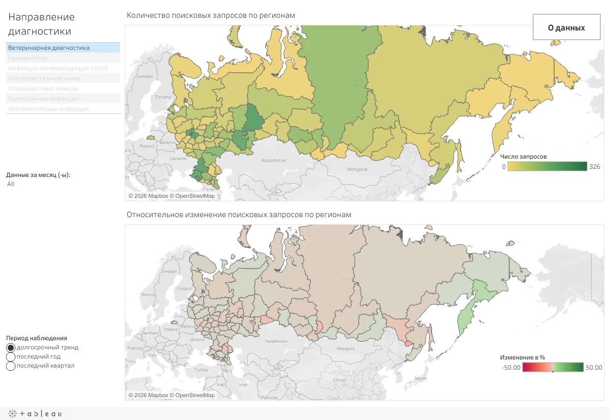
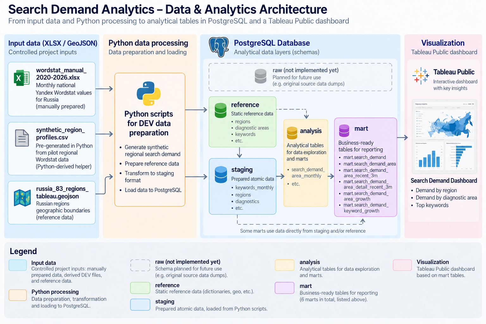

[← Back to AlphaLab Intelligence](../../README.md)

# Search Demand — Regional Market Intelligence

Interactive BI case for analyzing search demand for diagnostic services across Russian regions.

[View the interactive dashboard on Tableau Public](https://public.tableau.com/app/profile/evgeny.vinogradov/viz/AlphaLab_Public_Search_Demand/Regional_representation)

*The dashboard is presented in Russian because the case analyzes Russian-language search behavior in the Russian market.*

## Case materials

- [Architecture](assets/search_demand_architecture_en.png)
- [Analytical design](docs/analytical_design_en_ru.md)
- [AI-assisted development](../../docs/ai_assisted_development_en_ru.md)
- [Technical evidence](technical/README.md)

## Business context

Search Demand is an independent portfolio case designed around the market context of a specialized Russian manufacturer of PCR diagnostic test systems. It explores how search-interest data can serve as one external signal for marketing, sales, and management: to compare diagnostic areas, regions, and keywords and identify topics that warrant deeper competitor, customer, and sales analysis. It does not estimate market size and should not be used on its own for product or commercial decisions.

## Business problem

The analytical task was to create a systematic and reproducible view of search interest as one external market signal. Raw keyword-level observations require a shared analytical structure to support consistent comparisons across diagnostic areas, regions, and time periods.

The solution was designed to answer the following questions:

- Which diagnostic areas attract the highest level of search interest?
- How does search interest vary across regions?
- Which areas are growing or declining?
- Which individual queries contribute to search interest within each diagnostic area?
- How do current search-interest levels relate to recent growth?

### How the analysis can be used

- Add a comparable external signal to recurring market reviews.
- Identify diagnostic areas, regions, and keywords for deeper investigation.
- Inform discussions about the product portfolio, marketing, and sales alongside customer, competitor, and commercial data.

With API-based ingestion, validation of new data, and automated refresh of the analytical layer, the same model could support recurring monitoring. After each newly completed reporting period, it could help surface changes early enough to trigger further analysis and a timely management response.

The current public version uses a prepared snapshot and demonstrates the analytical logic of this future workflow.

## Analytical solution

The current demonstration dataset combines monthly nationwide Yandex Wordstat observations with synthetic regional allocation and curated keyword-to-area mappings. The analytical model organizes these data across diagnostic area, keyword, region, and time levels.

| Business question | Source and analytical model | Measure | Tableau view |
|---|---|---|---|
| Which diagnostic areas attract the highest level of search interest? | `staging.keywords_monthly` and the curated keyword-to-area mappings feed the full-history area mart `mart.search_demand_area`. | Monthly `query_count` by diagnostic area | Trends |
| How does search interest vary across regions? | The latest three complete months feed `mart.search_demand_area_recent_3m`, while precomputed regional growth metrics are provided by `mart.search_demand_area_growth`. | `query_count` for the selected month and regional `growth_pct` for `quarter`, `year`, or `all_time` | Regional representation |
| Which diagnostic areas are growing or declining? | The full-history series in `mart.search_demand_area` is combined with the precomputed metrics in `mart.search_demand_area_growth`. | Monthly `query_count` and area-level `growth_pct` for `quarter`, `year`, or `all_time` | Trends |
| Which individual queries contribute to search interest within each diagnostic area? | Keyword-level monthly series and keyword-to-area mappings feed `mart.search_demand_keyword_growth`. | `latest_month_query_count` for each keyword in the selected diagnostic area | Keywords comparison |
| How do current search-interest levels relate to recent growth? | Precomputed keyword-level metrics are provided by `mart.search_demand_keyword_growth`. | `latest_month_query_count` and `growth_pct` for the selected comparison period | Keywords comparison |

The public Tableau workbook uses prepared snapshot extracts derived from these analytical datasets and operates independently of the local PostgreSQL environment.

## Data

The public version uses a reproducible demonstration dataset prepared for publication.

- Monthly nationwide Yandex Wordstat totals for 2020–2026 are based on manually collected factual observations.
- These nationwide totals are allocated across 83 regions using population data, pilot regional Wordstat reference points, diagnostic-area profiles, and deterministic keyword-specific and monthly effects.
- For each keyword and month, the regional values are validated to preserve the corresponding nationwide total exactly.
- Google values are fully synthetic and are used to demonstrate the analytical model and cross-source comparisons.
- Regional geometry is based on **geoBoundaries**.

The demonstration dates are shifted back exactly 100 years: periods from 2020–2026 are represented as 1920–1926. This places the demonstration records in a separate time range, leaving the actual dates available for future API-sourced observations in the same analytical model.

The dataset supports demonstration of data modeling, quality checks, growth calculations, regional comparisons, and dashboard behavior. Factual conclusions about regional demand require measured regional observations.

## Delivered result

The case delivers a published Tableau Public workbook with three complementary views: regional comparison, time-series trends, and keyword-level comparison of search volume and growth.

The supporting analytical layer provides datasets at diagnostic-area and keyword levels. Implemented validation checks confirm that regional Yandex values reconcile exactly to the nationwide total for every keyword and month.

## Interpretation boundaries

Search demand serves as an indicator of user interest. Estimating market size, sales, revenue, patient counts, and actual utilization of diagnostic services requires corresponding commercial, customer, and clinical data.

The case supports comparative and exploratory analysis of the demonstration dataset. Factual conclusions about geographic demand patterns require measured regional observations.

Diagnostic areas can include multiple keywords, and the analytical model applies explicit keyword-to-area relationships. Aggregated values are meaningful at the analytical levels defined by the model. Additional totals built across other groupings require separate validation.

## Technical architecture

The working analytical environment uses:

- PostgreSQL 17;
- PostGIS;
- SQL-based analytical transformations;
- Tableau.

For publication, the database-dependent version was converted into a standalone Tableau Public workbook using prepared snapshot extracts and geographic data.

The analytical layer separates source/reference data, transformed analytical datasets, and presentation-oriented marts.

## My role

This is an independently initiated analytical project.

My contribution includes:

- business-problem decomposition;
- analytical requirements and methodology;
- data-model and analytical-layer design;
- definition of metrics and interpretation boundaries;
- dashboard and information design;
- validation and quality-control logic;
- organization and acceptance testing of AI-assisted implementation.

SQL and Python used in the project were produced with LLM assistance and are not presented as manually written code.

## Current status

The first public case — **Search Demand** — is published as an interactive Tableau Public workbook.
